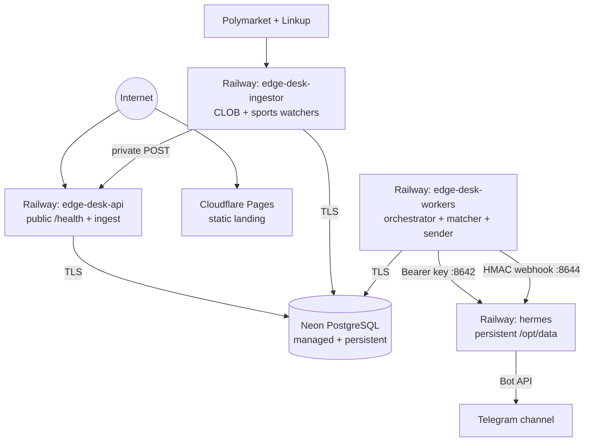

# Edge Desk deployment

The production-shaped deployment uses **Neon** for the team's PostgreSQL
database, **Railway** for the four long-running services, and **Cloudflare
Pages** for the static landing page. Only the API and landing page accept public
application traffic. Workers, ingestor, the Hermes Runs API, and the signed
Hermes webhook have no public Railway domain.



## What is version-controlled

- [`Dockerfile`](Dockerfile) builds both the API and worker services from the
  npm lockfile.
- [`deploy/hermes/Dockerfile`](deploy/hermes/Dockerfile) extends the official
  `nousresearch/hermes-agent:latest` image without replacing its init system.
- [`deploy/hermes/config.yaml`](deploy/hermes/config.yaml) restricts the Hermes
  API server to research/delegation tools and declares the signed, no-LLM
  Telegram delivery route.
- `deploy/railway/*.toml` contains the build/start/health policy for each Railway
  service. Set each service's Railway config-file path to its matching file.
- [`apps/landing/wrangler.toml`](apps/landing/wrangler.toml) declares the Pages
  output directory.

Secrets are deployment variables. Never put tokens or keys into these files.

## 1. Prepare secrets

Generate two different random secrets locally:

```sh
openssl rand -hex 32  # API_SERVER_KEY / HERMES_API_KEY
openssl rand -hex 32  # WEBHOOK_SECRET / HERMES_TELEGRAM_WEBHOOK_SECRET
```

Create the Telegram bot with `@BotFather`, add it to the target channel/group,
and give it permission to post. Keep the bot token and numeric chat ID ready.
Channel/group IDs are commonly negative, for example `-1001234567890`.

Hermes also needs one supported model credential. The supplied config uses
provider auto-detection; the simplest non-interactive deployment is an
`OPENROUTER_API_KEY`. `HERMES_MODEL` can override the default model without
rebuilding the image.

## 2. Create the Railway project

1. Create a Railway project and connect the GitHub repository
   `Mcverickk/money-scouts`.
2. In the team's Neon project, copy the pooled connection string (the hostname
   contains `-pooler`) with `sslmode=require`. Store it only as Railway's
   `DATABASE_URL`; never commit it.
3. Add four GitHub-repo services named exactly `edge-desk-api`,
   `edge-desk-ingestor`, `edge-desk-workers`, and `hermes`.
4. Configure all four services to deploy the `main` branch. A merge to `main`
   is therefore the production release boundary; work on `main-jai` does not
   deploy. Protect `main` in GitHub and require the repository's `CI / verify`
   check before merge.
5. In each service's settings, set the Railway config-file path:

   | Service | Config path | Public domain |
   | --- | --- | --- |
   | `edge-desk-api` | `/deploy/railway/api.toml` | Generate one |
   | `edge-desk-ingestor` | `/deploy/railway/ingestor.toml` | None |
   | `edge-desk-workers` | `/deploy/railway/workers.toml` | None |
   | `hermes` | `/deploy/railway/hermes.toml` | None |

6. Attach a persistent volume to `hermes` at `/opt/data`. Allocate at least
   1 GB RAM/1 vCPU; 2 GB RAM is safer for Chromium and parallel delegation.

The API's pre-deploy command runs `npm run db:migrate`. For the first release,
deploy the API first and confirm migration success, then deploy Hermes, workers,
and ingestor. Later releases can deploy automatically from `main`.

## 3. Set Railway variables

Use Railway reference variables for shared values when possible. Service names
in references are case-sensitive.

### `edge-desk-api`

```dotenv
DATABASE_URL=<neon-pooled-connection-string-with-sslmode=require>
NODE_ENV=production
PORT=3000
```

### `hermes`

```dotenv
API_SERVER_ENABLED=true
API_SERVER_HOST=0.0.0.0
API_SERVER_PORT=8642
API_SERVER_KEY=<random-api-secret>

WEBHOOK_ENABLED=true
WEBHOOK_PORT=8644
WEBHOOK_SECRET=<different-random-webhook-secret>

TELEGRAM_BOT_TOKEN=<botfather-token>
TELEGRAM_ALLOWED_USERS=<optional-comma-separated-user-ids>

OPENROUTER_API_KEY=<model-provider-key>
HERMES_MODEL=anthropic/claude-sonnet-4.6
```

The two listening ports are reachable through Railway private networking only.
Do not generate a public domain for this service.

### `edge-desk-workers`

```dotenv
DATABASE_URL=<neon-pooled-connection-string-with-sslmode=require>
NODE_ENV=production

HERMES_API_URL=http://hermes.railway.internal:8642
HERMES_API_KEY=${{hermes.API_SERVER_KEY}}
HERMES_API_MODEL=hermes-agent
HERMES_RUN_TIMEOUT_MS=45000
HERMES_REQUEST_TIMEOUT_MS=10000
HERMES_POLL_INTERVAL_MS=500

HERMES_TELEGRAM_WEBHOOK_URL=http://hermes.railway.internal:8644/webhooks/edge-desk-alert
HERMES_TELEGRAM_WEBHOOK_SECRET=${{hermes.WEBHOOK_SECRET}}
TELEGRAM_ALERT_CHAT_ID=<numeric-chat-id>

WORKER_ROLES=orchestrator,matcher,alert_sender
ORCHESTRATOR_POLL_INTERVAL_MS=1000
MATCHER_POLL_INTERVAL_MS=1000
ALERT_SENDER_POLL_INTERVAL_MS=1000
TELEGRAM_DELIVERY_TIMEOUT_MS=10000
TELEGRAM_MAX_ATTEMPTS=5
TELEGRAM_RETRY_BASE_MS=1000
TELEGRAM_RETRY_MAX_MS=60000

LINKUP_API_KEY=<linkup-key>
POLYMARKET_GAMMA_URL=https://gamma-api.polymarket.com
POLYMARKET_CLOB_URL=https://clob.polymarket.com
POLYMARKET_DATA_URL=https://data-api.polymarket.com
```

### `edge-desk-ingestor`

```dotenv
DATABASE_URL=<neon-pooled-connection-string-with-sslmode=require>
NODE_ENV=production
INGEST_API_URL=http://edge-desk-api.railway.internal:3000

LINKUP_API_KEY=<linkup-key>
POLYMARKET_GAMMA_URL=https://gamma-api.polymarket.com
POLYMARKET_CLOB_URL=https://clob.polymarket.com
POLYMARKET_DATA_URL=https://data-api.polymarket.com
POLYMARKET_SPORTS_WS_URL=wss://sports-api.polymarket.com/ws
```

If Railway does not allow a cross-service secret reference in your workspace,
paste the same generated value into Hermes and workers; do not generate a new
value for the worker side. The ingestor's API URL uses Railway's internal DNS,
so it does not traverse the public API domain.

## 4. Deploy the landing page

In Cloudflare Pages, import the same GitHub repository and configure:

| Setting | Value |
| --- | --- |
| Production branch | `main` |
| Root directory | `apps/landing` |
| Build command | leave empty |
| Build output directory | `public` |

Cloudflare will serve PR/branch previews separately and publish production only
after the PR is merged into `main`. A CLI deployment is also available from the
landing directory:

```sh
cd apps/landing
npx wrangler pages deploy
```

## 5. Verify a release

Run these checks in order:

1. Open `https://<api-domain>/health`; expect
   `{"status":"ok","db":"up"}`.
2. Confirm the API deployment log shows the database migration completed.
3. Confirm Hermes logs show the API server on `:8642`, webhook on `:8644`, and
   Telegram connected. A missing webhook secret must fail the gateway.
4. Confirm worker logs show all three roles started and no authentication or
   database errors. Confirm ingestor logs show the watched-market refresh; an
   empty watched set is valid until a market is registered.
5. From an `edge-desk-workers` Railway shell, exercise the real signed webhook
   client and Telegram path:

   ```sh
   npm run smoke:telegram
   ```

   Expect an `ok: true` JSON response and a message in the configured Telegram
   destination. This tests worker DNS, the HMAC secret, Hermes route rendering,
   the bot token, and channel permission in one step.
6. Inject one replay/event through the API or database test harness and verify
   `agent_runs -> decisions -> delivery_outbox -> sent`. The alert sender creates
   `+2/+3/+5` minute outcome jobs (default `OUTCOME_HORIZONS_MINUTES`, shortened
   from the spec's +10/+20/+40 for fast demo feedback) only after Telegram
   acknowledges delivery.

## Local container checks

Before merging a deployment change:

```sh
npm ci
npm run typecheck
npm test
docker build -t edge-desk-node .
docker build -f deploy/hermes/Dockerfile -t edge-desk-hermes .
```

The repository's normal local setup remains the fastest end-to-end development
loop; see [`README.md`](README.md) and [`docs/HERMES_INTEGRATION.md`](docs/HERMES_INTEGRATION.md).

## Operations and rollback

- Enable Neon backups/point-in-time restore and take a manual backup before a
  destructive migration. The current migration command is idempotent.
- Roll back API/ingestor/workers/Hermes independently from Railway's deployment
  history.
- Application rollback does **not** reverse a database migration. Prefer
  backward-compatible expand/migrate/contract changes and use a forward repair
  if a migration has already reached production.
- Keep `/opt/data` attached when rolling Hermes back; it contains auth/session
  state. The Edge Desk routing config is restored from the selected image on
  each start.
- Rotate `API_SERVER_KEY` and `WEBHOOK_SECRET` if either leaks, updating the
  Hermes and worker variables together.
- Give workers and ingestor Neon credentials through Railway secrets only. Keep
  workers, ingestor, and Hermes without public domains; only the API and
  Cloudflare landing site need public ingress.
