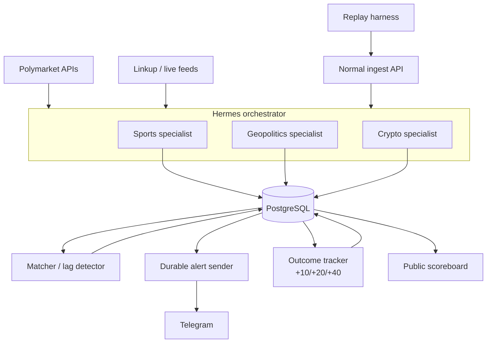

# Edge Desk

Edge Desk is an **agency**: a small team of domain-specialist AI agents that watches Polymarket order books and fresh real-world evidence, flags markets whose odds lag reality, and ships a cited Telegram alert instead of a trade.

For the hackathon track, rubric, and team logistics, see [../hackathon-context](../hackathon-context).

## The loop

Polymarket market selected (real API, no account needed)
→ manager routes the trigger to a sports, geopolitics, or crypto specialist
→ shared Polymarket and Linkup/live-feed tools gather prices and evidence
→ odds have not moved enough
→ lag detector scores it, evidence-cited
→ Telegram alert sent to a real chat
→ PostgreSQL stores the full per-alert audit trail and delivery outbox
→ cron tracks odds at +10/+20/+40 minutes
→ outcome (right/wrong) feeds back into the eval set and re-scores the agency
→ Cloudflare scoreboard updates publicly

Observability and eval are load-bearing for the score, not polish — build them alongside the first specialist, not after.

## Architecture

Each domain specialist uses shared price, evidence, and optional activity capabilities. This keeps domain interpretation specialized without duplicating provider integrations.

Memory (PostgreSQL-backed) has three layers: **now** (current market/specialist findings), **this market's/subscriber's past** (prior alerts, whether they converged, mute patterns), and **business rules** (lag-score thresholds, escalation logic).

See [TECH_ARCHITECTURE.md](TECH_ARCHITECTURE.md) for the full component breakdown, data model, and API contracts; [HERMES_MARKET_AGENT_CONTEXT.md](HERMES_MARKET_AGENT_CONTEXT.md) for responsibility boundaries and the trigger/decision contract; and [HERMES_INTEGRATION.md](HERMES_INTEGRATION.md) for exactly how the Hermes Agent runtime (delegation, Kanban, cron, Telegram gateway) is used to implement this loop.

## Data sources and known risk

- **Polymarket order books**: public CLOB reads need no account. Use the market WebSocket for live watched prices and REST for startup, recovery, and follow-up snapshots.
- **Polymarket big-wallet flows**: no clean single endpoint. Likely needs Polymarket's Data API/subgraph or direct on-chain queries against Polygon (Polymarket settles there), filtering for large USDC trades. **This is the highest-risk single task in the sprint** — owner: dev, spike first.
- **Linkup**: fresh evidence discovery shared by the domain specialists.
- **Historical replay**: for the demo's compressed convergence walkthrough and to seed the eval set, replay 1-2 already-resolved Polymarket markets with a clean, verifiable news trigger. Specific market not yet picked.

## MVP scope

**Must-have**: Hermes manager, sports specialist, shared Polymarket/evidence capabilities, deterministic lag detector, durable alert composer + Telegram delivery, PostgreSQL ledger, observability trace, `+10/+20/+40` outcome tracker, replay harness, and public scoreboard.

**Nice-to-have**: geopolitics and crypto specialists, Dodo entitlements, richer management UI, and additional messaging channels after verification.

**Cut for MVP**: compliance/disclaimer work beyond a clear notification-only label, auto-trading, and paid-channel gating. Add Dodo only after the core free-channel loop is stable.

## Persona

A part-time trader in Bangalore. The desk pings him ~11 minutes after an election-recount headline: the related market still prices the old odds, four large wallets already moved. He reads the evidence card and decides for himself — Edge Desk never trades for him. Now primarily the demo's narrative spine rather than a paying-customer profile.
