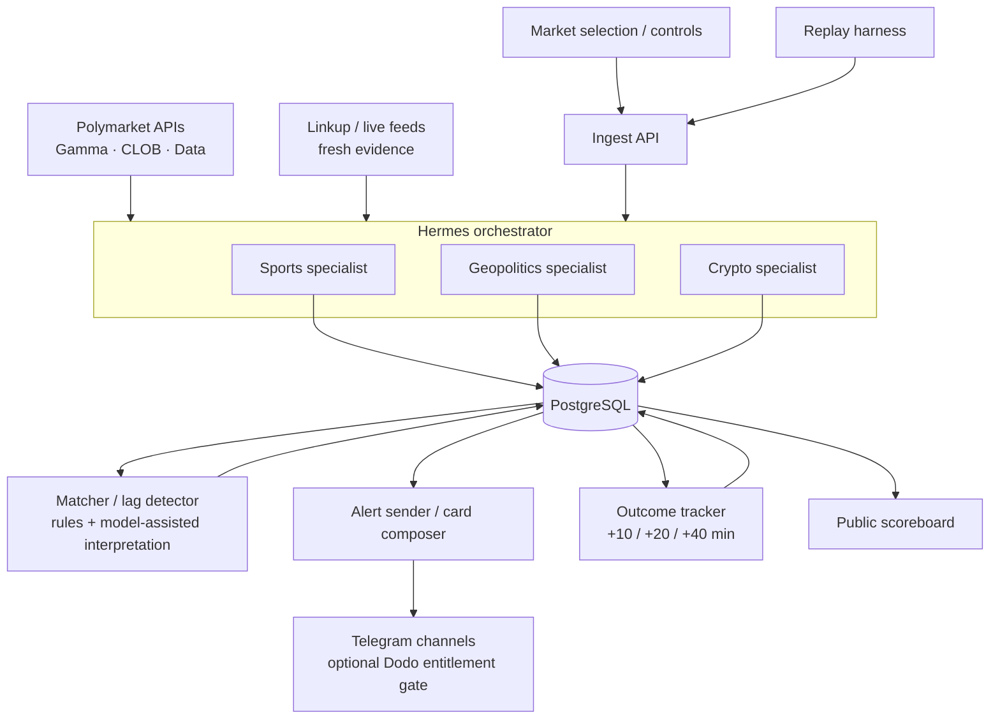

# Hermes + Market Analysis Agent Context

## Goal and MVP Boundary

Build a notification-only market intelligence agency for Polymarket. A user selects a market; the system watches Polymarket prices and fresh real-world evidence; when reality appears to have moved faster than the market, it sends a cited Telegram alert and later measures whether the call was correct.

The MVP does **not** place trades. A future trade executor must remain a separate, explicitly opted-in service.

## Canonical Architecture



PostgreSQL is the system of record for market snapshots, evidence, agent runs, decisions, alerts, deliveries, and outcomes. Durable alert delivery should use a transactional outbox or equivalent queued state so a process crash cannot lose an accepted alert.

The domain specialists are the visible Hermes organization. They share reusable capabilities instead of reimplementing integrations:

- `fetch_market_snapshot`: Gamma metadata plus CLOB price, spread, and depth.
- `fetch_fresh_evidence`: Linkup, a live match feed, or another category-appropriate source.
- `classify_event_impact`: normalize evidence into a category-specific signal.
- `match_signal_to_market`: compare expected movement with observed repricing.

This preserves domain expertise while keeping market-data and evidence contracts consistent across sports, geopolitics, and crypto.

## Responsibility Boundaries

### Hermes orchestration/runtime

- Receives normalized triggers and scheduled market checks.
- Selects the domain specialist from the stored market category.
- Delegates independent price and evidence work in parallel.
- Reviews stale, missing, or contradictory watcher results.
- Persists the run trace and schedules durable follow-ups.
- Sends composed alerts through the Telegram gateway.

### Domain specialist

- Applies category-specific event interpretation.
- Produces a normalized signal with direction, estimated impact, confidence, evidence references, and risk flags.
- Never sends a message or places a trade directly.

### Matcher / lag detector

- Joins a signal to a specific market and outcome token.
- Computes observed price movement from pre-event and current snapshots.
- Uses deterministic thresholds for freshness, spread, liquidity, cooldown, and minimum lag.
- May use an OpenAI model for extraction, classification, and concise reasoning, but not as the only numeric scoring mechanism.
- Writes an immutable decision record: `notify`, `ignore`, or `needs_review`.

### Alert sender

- Claims pending alert jobs idempotently.
- Composes the evidence card from the stored decision.
- Applies channel entitlement only if paid channels are enabled.
- Records Telegram delivery ID, attempts, and final status.

### Outcome tracker and scoreboard

- Records price snapshots at `+10`, `+20`, and `+40` minutes after a sent alert.
- Scores direction, magnitude, and data quality at each horizon.
- Publishes aggregate hit rate only from eligible, non-replay alerts; replay results are labeled separately.

### Future trade executor

- Holds signing keys outside the analysis and alerting services.
- Enforces user opt-in, exposure limits, slippage, liquidity, and a kill switch.
- Accepts or rejects a trade intent without affecting alert delivery.
- Logs every attempt and outcome.

## Trigger and Decision Contract

Example normalized trigger:

```json
{
  "eventId": "evt_01",
  "source": "sports_feed",
  "marketId": "polymarket-market-id",
  "category": "sports",
  "eventType": "goal",
  "eventText": "England goal",
  "occurredAt": "2026-07-12T14:33:00Z",
  "sourceUrl": "https://source.example/match",
  "data": {
    "match": "Norway vs England",
    "minute": 63,
    "score": "Norway 0 - 1 England"
  }
}
```

Example matcher decision:

```json
{
  "decisionId": "dec_01",
  "action": "notify",
  "side": "buy_yes",
  "confidence": 0.78,
  "expectedMoveBps": 900,
  "observedMoveBps": 250,
  "lagBps": 650,
  "reason": "England's goal materially increases its win probability, while the market has moved only 2.5 points.",
  "riskFlags": [],
  "evidenceIds": ["evidence_01"],
  "marketSnapshotId": "snapshot_02"
}
```

## Reliability Rules

- Give every inbound event a stable source/event idempotency key.
- Store source time and ingestion time separately; reject or flag stale evidence.
- Capture a pre-event baseline when available. Never infer lag from the current price alone.
- Keep raw provider payloads for replay and audit, but expose normalized schemas to agents.
- Write the decision and pending delivery job in one database transaction.
- Deduplicate by market, event, outcome, side, and cooldown window.
- Replay fixtures must enter through the normal ingest API with `mode: "replay"`; they must not write directly to production tables.
- Keep live and replay metrics separate on the scoreboard.

## Recommended Build Order

1. Notification-only flow for one sports market.
2. PostgreSQL schema, idempotent ingest, and stored run trace.
3. Shared Polymarket and evidence tools plus the sports specialist.
4. Deterministic matcher and model-written, cited explanation.
5. Durable Telegram outbox and delivery receipt.
6. `+10/+20/+40` outcome jobs and scoreboard.
7. Replay fixtures through the same ingest path.
8. Geopolitics and crypto specialists using the same contracts.
9. Optional Dodo channel entitlements.
10. Auto-trading only after the alert and evaluation pipeline is reliable.

## Demo Framing

Polymarket is the core venue. Hermes is the visible agent infrastructure: an orchestrator, named domain specialists, traceable task history, Telegram delivery, and scheduled self-evaluation. The strongest demo is one end-to-end alert whose inputs, reasoning, delivery receipt, and follow-up outcomes can all be opened from the same run.
