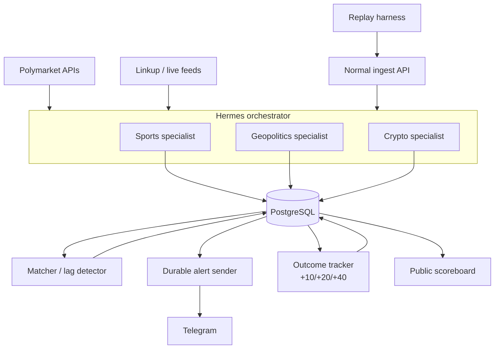

# Edge Desk

Edge Desk is an **agency**: a small team of domain-specialist AI agents that watches Polymarket order books and fresh real-world evidence, flags markets whose odds lag reality, and ships a cited Telegram alert instead of a trade.

Track: **AI as Agency** (not Revenue). Root proof is a working, observable, self-evaluating agent org, not paying subscribers.

## The loop

Polymarket market selected (real API, no account needed)
→ manager routes the trigger to a sports, geopolitics, or crypto specialist
→ shared Polymarket and Linkup/live-feed tools gather prices and evidence
→ odds have not moved enough
→ lag detector scores it, evidence-cited
→ Telegram alert sent to a real chat
→ PostgreSQL stores the full per-alert audit trail and delivery outbox
→ cron tracks odds at +10/+20/+40 minutes
→ outcome (right/wrong) feeds back into the eval set and re-scores the agency
→ Cloudflare scoreboard updates publicly

Observability and eval are load-bearing for the score, not polish — build them alongside the first specialist, not after.

## Architecture



Each domain specialist uses shared price, evidence, and optional activity capabilities. This keeps domain interpretation specialized without duplicating provider integrations.

Memory (PostgreSQL-backed) has three layers: **now** (current market/specialist findings), **this market's/subscriber's past** (prior alerts, whether they converged, mute patterns), and **business rules** (lag-score thresholds, escalation logic).

## Hermes Agent — implementation detail

Confirmed: this is [Nous Research's Hermes Agent](https://github.com/nousresearch/hermes-agent), an open-source agent runtime with a CLI, gateway daemon, and documented API surface. ([docs](https://hermes-agent.nousresearch.com/docs/))

It ships with two *different* delegation primitives, and picking the right one for each part of Edge Desk matters for the score, not just for getting it working:

### `delegate_task` — for real-time capability fan-out

```python
delegate_task(tasks=[
    {"goal": "Check order book for market X, report current odds + depth", "toolsets": ["web"]},
    {"goal": "Search for breaking news on market X's topic in the last 30 min", "toolsets": ["web"]},
    {"goal": "Check large wallet activity on market X", "toolsets": ["web"]},
])
```

- Synchronous, parallel, fast (`ThreadPoolExecutor`, default 3 concurrent children). Each subagent gets a **fresh conversation** — zero shared history, so the manager must pass full context via `goal`/`context`.
- Only the final summary returns to the parent — cheap on tokens, but **the intermediate results are not durably stored** unless we explicitly write them to PostgreSQL.
- This is the right tool for a specialist's price/evidence/activity fan-out: the checks need to run *now*, in parallel, and report back into a single lag-detection pass. It matches the cost/latency target (sub-1-minute per cycle) since it is a direct RPC, not a polling loop.

### Kanban — for the alert's lifecycle, review, and escalation

This is the better fit for the manager/org-structure and observability requirements, and I didn't expect it going in — it's built almost exactly for what the rubric's L4/L5 org-structure examples describe:

- A durable SQLite task board (`~/.hermes/kanban.db`), not a fire-and-forget call. Every task is a row with a status lifecycle (`triage → todo → ready → running → blocked → done → archived`), an assignee (a **named** specialist profile, not an anonymous subagent), and a full event history (`task_events` table) that survives forever — this *is* the observability trace the rubric asks for ("pick a run and see what each agent did, step by step").
- `kanban_block(reason)` / `kanban_comment()` / `kanban_unblock()` is a built-in review-and-send-back-for-revision loop — literally the L4 org-structure criterion ("manager... reviews outputs, sends back for revision").
- Dependency links (`kanban_create(..., parents=[...])`) mean the lag-detector task can start only once all required capability tasks complete — no custom join logic needed.
- `hermes kanban watch` / `hermes dashboard` gives a live board view for free — this can BE (or back) the management UI and the observability dashboard, rather than building either from scratch.
- **L5 org-structure stretch is a config flag, not new code**: default `max_spawn_depth` is 1 (flat). Setting a profile's `role="orchestrator"` and raising `max_spawn_depth` lets the manager spawn new specialist roles mid-task — the exact "emergent org" criterion.
- Auto-decomposition (`kanban.auto_decompose: true`, default) can run an LLM decomposer on a "watch market X" triage task and fan it into the graph automatically — this can *be* the manager's planning step instead of us hand-writing it.

**Recommended split:** each domain specialist uses `delegate_task` for fast capability fan-out; the alert's post-publish lifecycle (outcome tracking, review, escalation-by-exception, eval feedback) runs as durable tasks, because that part of the pipeline must survive the 10–40 minute convergence window, be inspectable afterward, and support human review on exceptions.

### Cron — the outcome tracker

```python
cronjob(action="create", name="edge-desk-outcomes",
        schedule="every 1m", script="edge-desk-outcomes.py",
        no_agent=True, deliver="telegram")
```

- PostgreSQL `outcome_jobs` remains the authoritative list of `+10/+20/+40` work. A frequent Hermes cron script can atomically claim due rows, fetch prices, and write outcomes.
- The gateway daemon ticks the scheduler every 60 seconds. In `no_agent=True` mode the script runs without an LLM; empty stdout stays silent, while failures can still deliver to Telegram.
- Use an agent only for a disputed outcome that requires interpretation. Routine price math stays deterministic and near-zero token cost.

### Messaging gateway — Telegram (your integration task)

1. Create the bot via **@BotFather** (`/newbot`) → get `TELEGRAM_BOT_TOKEN`.
2. `hermes gateway setup` (interactive) or set `TELEGRAM_BOT_TOKEN` / `TELEGRAM_ALLOWED_USERS` in `~/.hermes/.env`.
3. `hermes gateway` to test in foreground; `hermes gateway install --system` for a persistent systemd/launchd service during the demo.
4. **Subscriber onboarding maps directly onto Hermes' DM pairing flow**: an unknown user messages the bot, gets a one-time pairing code, we approve via `hermes pairing approve telegram [CODE]` — this can double as the "subscriber" concept without building custom auth.
5. `/sethome` or `TELEGRAM_HOME_CHANNEL` sets where cron output and proactive alerts land — this is the public/shared alert channel.
6. The gateway supports additional messaging platforms through the same daemon. Treat multi-channel delivery as a later extension and verify the desired adapter before committing scope.

### Memory split

Hermes' own memory (`MEMORY.md`/`USER.md`, agent-curated, FTS5 session search) is the agent's *working notes* layer. It is **not** a replacement for PostgreSQL: PostgreSQL stays the product's structured, mentor-inspectable ledger (alert history, subscriber filters, outcome scores). Cooldown enforcement belongs in deterministic database-backed policy, not only in agent memory.

### How this gets "detected" / verified by mentors

Because Kanban's `task_events` table, run history, and dashboard are durable and queryable by construction, the standard rubric verification pattern ("mentor names a past run, team opens it live") is satisfied by `hermes kanban show <id>` / `hermes kanban runs <id>` / `hermes dashboard` directly — no extra tooling required to prove Hermes is the real runtime, not window dressing.

### Open implementation risks

- **Dispatch latency vs. the cost/latency L5 target**: Kanban's dispatcher polls every 60s by default (`dispatch_interval_seconds`) — that alone risks blowing a sub-1-minute budget before any work happens. Tune this down for the demo, or keep the tightest-latency step (capability fan-out → lag score) on `delegate_task` and reserve Kanban for the slower post-alert lifecycle where 60s polling does not matter.
- **Token/cost-per-step isn't natively surfaced by Kanban** — capture usage at step completion and write it into PostgreSQL to hit the Observability L4 "tokens and cost per step" bar.
- **Requires an LLM provider** — Nous Portal, OpenRouter, or OpenAI key via `hermes model` / `hermes setup --portal`. Whoever sets up the gateway needs one before anything runs live.

## Scoring targets

| Parameter | Weight | Target | What proves it for Edge Desk |
| --- | --- | --- | --- |
| Working product, real output | 20x (max 80) | L4, stretch L5 | Real Polymarket API + real Telegram send + durable PostgreSQL writes, no staging. Alerts are informational (no trade execution), so the pipeline can run end-to-end autonomously and escalate only low-confidence calls to a human. |
| Agent org structure | 5x (max 20) | L4, stretch L5 | Manager routes to a named domain specialist; the specialist dispatches price/evidence capability tasks and reviews outputs before the lag detector runs. L5 stretch: manager spawns a one-off deep-dive specialist on ambiguous signals, and agents escalate with a concrete blocker instead of failing silently. |
| Observability | 7x (max 28) | L4 | Second-highest weight on the whole rubric — invest here. Per-alert trace tree (specialist and capability results, lag score, delivery), tokens/cost per step, filterable by role or market. Stretch: diff a good alert vs. a bad one side by side. |
| Evaluation and iteration | 5x (max 20) | L4, stretch L5 | The outcome tracker *is* the eval loop: named set of historical resolved markets with known good/bad calls, run before/after changes; ideally closed-loop, where a wrong alert becomes a new eval case and reweights the lag detector automatically. |
| Agent handoffs and memory | 2x (max 8) | L4, stretch L5 | PostgreSQL holds market history, subscriber filters, and threshold policy; the manager passes accumulated signal context (not raw data) across the handoff chain. |
| Cost and latency per task | 1x (max 4) | L5 | One specialist check + lag-scoring cycle is cheap, read-only API calls — realistic sub-1-minute, sub-$0.10. Show this from the trace, not a claim. |
| Management UI | 1x (max 4) | L3, stretch L4 | Non-engineer can add/remove watched markets, edit filters, and pause monitoring from a UI, not code. |

### Power-ups, priority order

PostgreSQL (core ledger), Linkup (evidence discovery), and Cloudflare (scoreboard/hosting) are core. Dodo Payments is an optional entitlement gate—pursue it only after free-channel delivery is stable. ElevenLabs/Wispr Flow have no natural fit in a text-alert product; skip them unless voice ends up in the control surface.

## Data sources and known risk

- **Polymarket order books**: public CLOB reads need no account. Use the market WebSocket for live watched prices and REST for startup, recovery, and follow-up snapshots.
- **Polymarket big-wallet flows**: no clean single endpoint. Likely needs Polymarket's Data API/subgraph or direct on-chain queries against Polygon (Polymarket settles there), filtering for large USDC trades. **This is the highest-risk single task in the sprint** — owner: dev, spike first.
- **Linkup**: fresh evidence discovery shared by the domain specialists.
- **Historical replay**: for the demo's compressed convergence walkthrough and to seed the eval set, replay 1-2 already-resolved Polymarket markets with a clean, verifiable news trigger. Specific market not yet picked.

## MVP scope

**Must-have**: Hermes manager, sports specialist, shared Polymarket/evidence capabilities, deterministic lag detector, durable alert composer + Telegram delivery, PostgreSQL ledger, observability trace, `+10/+20/+40` outcome tracker, replay harness, and public scoreboard.

**Nice-to-have**: geopolitics and crypto specialists, Dodo entitlements, richer management UI, and additional messaging channels after verification.

**Cut for MVP**: compliance/disclaimer work beyond a clear notification-only label, auto-trading, and paid-channel gating. Add Dodo only after the core free-channel loop is stable.

## Team and constraints

8-hour build sprint. 3 people, everyone has Codex/Claude Code so raw implementation speed on basic tasks isn't the bottleneck — the real risk is who's deciding the *design* for the tasks that need judgment, not just typing.

- **Dev**: shared Polymarket adapters (metadata, order book, and optional activity)
- **Business**: landing page design + implementation
- **Product (you)**: Hermes research and how it integrates with Telegram

Hermes is mandatory (it must appear in the build tooling or agent architecture itself). Not yet assigned to a specific owner: Linkup evidence integration, manager planning/review, sports-specialist interpretation, lag-detector policy, alert composer/outbox, PostgreSQL schema, and observability/evaluation. These carry real point weight and need owners before the sprint starts.

## Persona

A part-time trader in Bangalore. The desk pings him ~11 minutes after an election-recount headline: the related market still prices the old odds, four large wallets already moved. He reads the evidence card and decides for himself — Edge Desk never trades for him. Now primarily the demo's narrative spine rather than a paying-customer profile.
