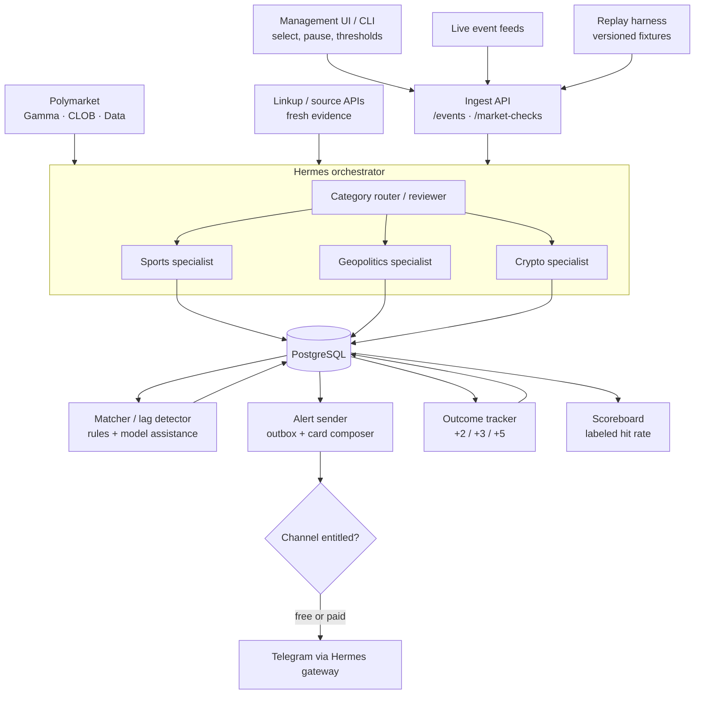
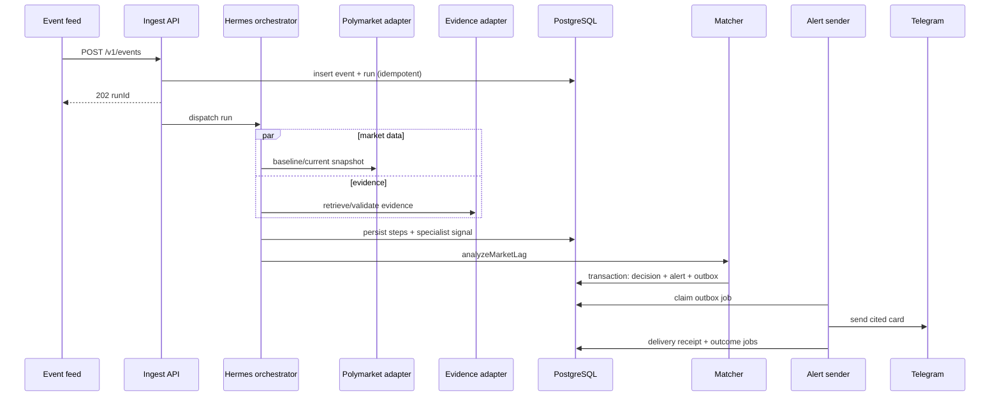

# Edge Desk / Hermes Market Agent Technical Architecture

## 1. Product Scope

Edge Desk is a notification-only market intelligence agency for Polymarket. A user selects a market, the system watches external events and Polymarket prices, and Telegram receives a cited alert when reality appears to have moved faster than the market.

The MVP must prove one complete, inspectable loop:

```text
selected market
-> normalized live or replay trigger
-> Hermes domain specialist gathers price and evidence
-> matcher estimates expected move vs observed repricing
-> durable Telegram alert
-> +2/+3/+5 minute price checks
-> scored outcome and public aggregate
```

The first version must not auto-trade. A future trade executor remains isolated from analysis, messaging, and signing-key-free services.

## 2. Architecture Decisions

### 2.1 Canonical decisions

- **Hermes is the orchestration/runtime layer**, not the pricing brain.
- **Domain specialists are the visible agent organization**: sports, geopolitics, and crypto.
- **Shared capabilities sit below those specialists**: Polymarket snapshots, evidence retrieval, normalization, and decision scoring.
- **PostgreSQL is the system of record** for configuration, raw inputs, snapshots, traces, decisions, alerts, deliveries, and outcomes.
- **Telegram is the first delivery channel** through the Hermes gateway.
- **Polymarket Gamma, CLOB, and Data APIs have distinct adapters** for metadata, order books/prices, and activity where needed.
- **Use the CLOB market WebSocket for live watched prices**; reserve REST for startup snapshots, manual checks, follow-up horizons, and recovery.
- **Linkup or a direct live feed supplies fresh evidence**; every cited fact retains source and retrieval timestamps.
- **The matcher is hybrid**: deterministic numeric gates plus model-assisted extraction, classification, and explanation.
- **Alert delivery uses a transactional outbox** so an accepted decision is not lost after a crash.
- **Replay enters through the normal ingest API** and is labeled; it never writes synthetic rows directly into live tables.
- **Outcomes are measured at +2, +3, and +5 minutes** (`OUTCOME_HORIZONS_MINUTES`; shortened from an original +10/+20/+40 spec for fast demo feedback). Replay and live aggregates stay separate.
- **Dodo entitlements are optional and downstream of analysis**; a payment outage must not stop the core pipeline.

### 2.2 Why domain agents and shared tools are both needed

The proposed flowchart correctly makes sports, geopolitics, and crypto separate specialists: interpreting a red card is different from interpreting an election injunction or an exchange liquidation. They should not, however, each implement their own Polymarket and Linkup clients.

Each specialist produces the same normalized signal contract:

```json
{
  "category": "sports",
  "direction": "yes_up",
  "expectedMoveBps": 900,
  "confidence": 0.82,
  "summary": "England scored at 63 minutes and now leads 1-0.",
  "evidenceIds": ["evidence_01"],
  "riskFlags": []
}
```

This makes the matcher, alert sender, tracker, replay harness, and scoreboard category-agnostic.

## 3. High-Level System



PostgreSQL arrows represent durable state transitions, not a requirement that every component poll tables. The API may enqueue work, and workers may use `LISTEN/NOTIFY`, a database-backed job queue, or short polling for the MVP. PostgreSQL remains the authoritative state.

## 4. Components and Responsibilities

### 4.1 Management UI / CLI

Allows an operator to:

- Add a Polymarket market and map its outcomes/token IDs.
- Assign `sports`, `geopolitics`, or `crypto` category.
- Pause/resume monitoring.
- Set confidence, lag, spread, liquidity, freshness, and cooldown thresholds.
- Trigger a manual live check or a labeled replay.
- Inspect runs, evidence, decisions, deliveries, and outcomes.

For the buildathon this may be one dashboard page plus a minimal market form.

### 4.2 Event Ingest API

Owns validation, authentication, normalization, and deduplication of external triggers.

Endpoints:

- `POST /v1/events`: live event/news/webhook ingest.
- `POST /v1/market-checks`: scheduled or manual market evaluation.
- `POST /v1/replays`: start a versioned replay through the same event path.
- `GET /health`: liveness and dependency summary.

The API must:

- Require a stable `sourceEventId` for event deduplication.
- Store `occurredAt` separately from `receivedAt`.
- Resolve the selected market and category before dispatch.
- Reject invalid mappings; mark stale but otherwise valid events for reviewer policy.
- Return quickly with a durable run ID rather than wait for all agents.

Example event:

```json
{
  "sourceEventId": "provider-match-123-goal-63",
  "source": "sports_feed",
  "marketId": "polymarket-market-id",
  "category": "sports",
  "eventType": "goal",
  "eventText": "England goal",
  "occurredAt": "2026-07-12T14:33:00Z",
  "sourceUrl": "https://source.example/match",
  "data": {
    "match": "Norway vs England",
    "minute": 63,
    "score": "Norway 0 - 1 England"
  }
}
```

### 4.3 Hermes Orchestrator

Owns the traceable agent workflow.

Responsibilities:

- Load market config, baseline snapshot, and recent alert history.
- Route the event to one domain specialist.
- Fan out independent market and evidence calls in parallel.
- Review outputs for freshness, missing mappings, contradictions, or provider failures.
- Retry safe transient failures; otherwise finish as `blocked` with a concrete reason.
- Persist each step's input references, status, latency, model, tokens, and cost where available.
- Invoke the matcher only after required inputs pass validation.
- Create durable follow-up lifecycle work after an alert is sent.

Use Hermes' fast delegation primitive for latency-sensitive fan-out and durable task/cron facilities for lifecycle steps that must survive the initiating session. The database trace is the product audit record even when Hermes also retains its own task history.

### 4.4 Shared Polymarket Adapter

Provides normalized operations to every domain specialist:

- Resolve market metadata and outcome token IDs.
- Subscribe to live outcome price, best bid/ask, spread, and trade updates through the CLOB market WebSocket.
- Fetch REST snapshots on startup, reconnect, manual checks, and scheduled outcome checks.
- Fetch order-book depth for a configured notional.
- Optionally fetch relevant market/trade activity.
- Persist raw response metadata and normalized snapshots.

Example snapshot:

```json
{
  "marketId": "polymarket-market-id",
  "outcome": "England",
  "tokenId": "token-id",
  "yesPrice": 0.54,
  "bestBid": 0.53,
  "bestAsk": 0.55,
  "spreadBps": 200,
  "depthUsd": 18342,
  "observedAt": "2026-07-12T14:33:08Z"
}
```

A matcher needs both a pre-event baseline and a current snapshot. If no trustworthy baseline exists, the decision must be `needs_review` or `ignore`; current price alone cannot establish lag.

### 4.5 Shared Evidence Adapter

Retrieves or accepts fresh external evidence:

- Sports can treat a trusted live event payload as primary evidence and optionally corroborate it.
- Geopolitics should prefer primary announcements/court/election sources when available and use search for discovery.
- Crypto should distinguish project/exchange announcements, market telemetry, and unverified social posts.

Example evidence record:

```json
{
  "eventSummary": "England scored in the 63rd minute and now leads 1-0.",
  "evidence": [
    {
      "title": "Live match feed",
      "url": "https://source.example/match",
      "publishedAt": "2026-07-12T14:33:00Z",
      "retrievedAt": "2026-07-12T14:33:11Z",
      "relevance": 0.92,
      "sourceTier": "primary"
    }
  ],
  "freshnessSeconds": 11,
  "confidence": 0.89
}
```

The system stores the evidence excerpt/hash needed for audit without depending on a mutable headline at evaluation time.

### 4.6 Domain Specialists

#### Sports specialist

Interprets goals, score changes, cards, injuries, lineups, clock/game state, and settlement rules. The first MVP should implement this specialist only.

#### Geopolitics specialist

Interprets elections, court decisions, official statements, conflicts, and deadlines. It must flag ambiguous market-resolution wording and conflicting sources.

#### Crypto specialist

Interprets listings, protocol incidents, regulatory actions, liquidations, and price/volume shocks. It must flag circular reporting and unverified announcements.

Every specialist returns the normalized signal contract. It does not create alerts or talk directly to Telegram.

### 4.7 Matcher / Lag Detector

Joins the specialist signal to a specific market outcome and decides whether there is actionable lag.

Inputs:

- Normalized event and evidence.
- Specialist signal.
- Pre-event and current Polymarket snapshots.
- Spread, available depth, and snapshot freshness.
- Market thresholds and prior alert history.

Core calculation:

```text
observedMoveBps = (currentPrice - preEventPrice) * 10_000
signedObservedMoveBps = observedMoveBps * signalDirection
lagBps = expectedMoveBps - signedObservedMoveBps
```

For a downward signal, `signalDirection` is `-1`; for an upward signal it is `+1`. This prevents the common error of applying an upward-only lag formula to both directions.

Notify only when:

- Evidence confidence meets the market threshold.
- Evidence and price snapshots are within freshness limits.
- The baseline predates the event and the current snapshot follows it.
- Spread is at or below the configured maximum.
- Depth/liquidity meets the configured minimum.
- `lagBps` meets the configured minimum in the predicted direction.
- No matching alert exists inside the cooldown window.
- No hard risk flag is present.

Example decision:

```json
{
  "action": "notify",
  "side": "buy_yes",
  "confidence": 0.78,
  "expectedMoveBps": 900,
  "observedMoveBps": 250,
  "lagBps": 650,
  "reason": "England's goal materially increases its win probability, while the market has moved only 2.5 points.",
  "riskFlags": [],
  "evidenceIds": ["evidence_01"],
  "baselineSnapshotId": "snapshot_01",
  "currentSnapshotId": "snapshot_02",
  "scoringPolicyVersion": "sports-v1"
}
```

OpenAI may extract structured event features, classify ambiguous impact, and write the explanation. Deterministic code owns price math, thresholds, deduplication, and the final safety gates.

### 4.8 Alert Sender

The matcher writes a decision and outbox row atomically. A sender worker claims pending rows with row locking, composes the card, calls the Hermes Telegram gateway, and records delivery state.

Telegram format:

```text
EDGE DESK ALERT

Market: Norway vs England
Signal: BUY YES — England
Confidence: 78%
Current price: 54c
Estimated remaining lag: +6.5 pts

Why:
England scored at 63' and now leads 1-0. The market moved only from 51.5c to 54c.

Evidence:
1. Live match feed — 14:33 UTC

Trace: run_abc123
Mode: notification only
```

Delivery rules:

- Use an idempotency key derived from decision and channel.
- Retry transient failures with capped exponential backoff.
- Move exhausted jobs to `dead_letter` and surface them in the dashboard.
- Record the Telegram message ID and attempt history.
- If paid channels exist, check a cached entitlement immediately before send. Analysis still completes if the entitlement provider is unavailable.

The idempotency key prevents two local workers from intentionally sending the same alert. Telegram does not provide a general client-supplied idempotency key, so an ambiguous network timeout after provider acceptance can still produce a rare duplicate on retry; preserve the attempt for reconciliation and make the alert trace ID visible in the message.

### 4.9 Outcome Tracker

When an alert reaches `sent`, create follow-up jobs for `+2`, `+3`, and `+5` minutes from `sentAt`
(`OUTCOME_HORIZONS_MINUTES`; shortened from an original +10/+20/+40 spec for fast demo feedback).

Each job:

- Fetches a new price snapshot from the same outcome token.
- Computes signed movement from alert-time price.
- Labels `correct`, `wrong`, `flat`, or `invalid_data` using a versioned evaluation policy.
- Records lateness and provider errors rather than silently shifting the intended horizon.
- Runs without an LLM unless a disputed case needs interpretation.

Late jobs should preserve both `scheduledFor` and `checkedAt`. A check intended for +2 minutes but executed at +5 must not be presented as a +2 observation.

### 4.10 Scoreboard

Reads outcomes and publishes:

- Eligible alerts and sample size.
- Directional hit rate at each horizon.
- Median signed move and lag capture.
- Alerts by category and policy version.
- Data-error and inconclusive counts.
- Live results separately from replay results.

“Pinned hit rate” means the metric definition and evaluation policy are versioned. It must not mean a manually frozen favorable number.

### 4.11 Replay Harness

The replay harness compresses a known event timeline for demos and regression tests.

- Fixtures are immutable and versioned.
- A replay calls `POST /v1/replays`, which emits the same normalized event contract as live ingest.
- Provider time can be supplied by an injectable clock.
- Fixture snapshots are served through adapter interfaces, not inserted directly into outcome tables.
- Every generated row carries `mode = replay` and `replayRunId`.
- Replays never send to production Telegram channels unless an explicit demo channel is configured.

This tests validation, routing, matching, alerting, and evaluation rather than merely preloading a successful result.

## 5. PostgreSQL Data Model

Use UUID/ULID primary keys, `timestamptz` for time, `jsonb` for raw provider payloads, and explicit foreign keys. The logical tables are:

### `markets`

- `id`, `polymarket_market_id`, `slug`, `title`
- `category`: `sports | geopolitics | crypto`
- `status`: `active | paused | resolved`
- `thresholds jsonb`
- `created_at`, `updated_at`

Unique: `polymarket_market_id`.

### `market_outcomes`

- `id`, `market_id`, `name`, `token_id`, `side`

Unique: `(market_id, token_id)`.

### `events`

- `id`, `market_id`, `source`, `source_event_id`
- `event_type`, `event_text`, `source_url`, `payload jsonb`
- `occurred_at`, `received_at`
- `mode`: `live | replay`
- `replay_run_id nullable`

Use two partial unique indexes so PostgreSQL `NULL` semantics cannot bypass live deduplication:

- `(source, source_event_id)` where `mode = 'live'`.
- `(source, source_event_id, replay_run_id)` where `mode = 'replay'`.

### `market_snapshots`

- `id`, `market_id`, `outcome_id`
- `yes_price`, `best_bid`, `best_ask`, `spread_bps`, `depth_usd`
- `provider`, `provider_ref`, `raw_payload jsonb`, `observed_at`
- `mode`, `replay_run_id nullable`

Index: `(outcome_id, observed_at desc)`.

### `evidence`

- `id`, `event_id`, `title`, `url`, `excerpt`, `content_hash`
- `source_tier`, `published_at`, `retrieved_at`
- `relevance`, `confidence`, `raw_payload jsonb`

### `agent_runs`

- `id`, `market_id`, `event_id nullable`, `hermes_task_id nullable`
- `specialist`, `status`, `mode`, `replay_run_id nullable`
- `started_at`, `completed_at`, `latency_ms`
- `model`, `input_tokens`, `output_tokens`, `cost_usd`
- `error_code`, `error_message`

### `run_steps`

- `id`, `run_id`, `name`, `agent_role`, `status`, `attempt`
- `input_refs jsonb`, `output jsonb`, `source_refs jsonb`
- `started_at`, `completed_at`, `latency_ms`
- `model`, `input_tokens`, `output_tokens`, `cost_usd`
- `error_code`, `error_message`

Unique: `(run_id, name, attempt)`.

### `decisions`

- `id`, `run_id`, `market_id`, `outcome_id`
- `action`: `notify | ignore | needs_review`
- `side`, `confidence`, `expected_move_bps`, `observed_move_bps`, `lag_bps`
- `reason`, `risk_flags text[]`
- `baseline_snapshot_id`, `current_snapshot_id`
- `scoring_policy_version`, `created_at`

Decisions are immutable. Re-analysis creates another version linked to the same run or a new run.

### `alerts`

- `id`, `decision_id`, `run_id`, `market_id`
- `message`, `status`: `pending | sending | sent | failed | suppressed`
- `entitlement_tier`, `created_at`, `sent_at nullable`

Unique: `decision_id`. Only `notify` decisions create alert rows.

### `delivery_outbox`

- `id`, `alert_id`, `channel`, `destination`
- `idempotency_key`, `status`, `attempt_count`, `next_attempt_at`
- `provider_message_id`, `last_error`, `created_at`, `sent_at`

Unique: `idempotency_key`.

### `outcome_jobs`

- `id`, `alert_id`, `horizon_minutes`
- `scheduled_for`, `status`, `attempt_count`, `last_error`

Unique: `(alert_id, horizon_minutes)`.

### `outcomes`

- `id`, `outcome_job_id`, `alert_id`, `snapshot_id`
- `scheduled_for`, `checked_at`, `horizon_minutes`
- `price_at_check`, `signed_move_bps`
- `eval_label`: `correct | wrong | flat | invalid_data`
- `evaluation_policy_version`, `notes`

Unique: `outcome_job_id`.

### `replay_runs`

- `id`, `fixture_name`, `fixture_version`, `status`
- `clock_config jsonb`, `started_at`, `completed_at`

## 6. API Contracts

### `POST /v1/markets`

Operator registers a market to watch. The API resolves metadata and outcome token IDs via Gamma, upserts `markets`/`market_outcomes`, then takes a best-effort initial baseline snapshot per outcome via CLOB REST (`provider='clob_rest'`) — registration succeeds even if snapshots fail.

```json
{
  "slugOrId": "will-england-beat-norway",
  "category": "sports",
  "gameSlug": "epl-norway-england-2026-07-12",
  "thresholds": {}
}
```

Returns `201 Created` (or `200` with the existing row when the Polymarket market is already registered):

```json
{
  "marketId": "market-uuid",
  "polymarketMarketId": "polymarket-market-id",
  "title": "Will England beat Norway?",
  "category": "sports",
  "outcomes": [{ "id": "outcome-uuid", "name": "England", "tokenId": "token-id" }],
  "baselineSnapshots": 2
}
```

`502` when Gamma cannot resolve the market; `gameSlug` links sports markets to the live-score feed (migration 002).

### `POST /v1/events`

Returns `202 Accepted` after the event and initial run are durable:

```json
{
  "eventId": "evt_01",
  "runId": "run_01",
  "status": "accepted",
  "duplicate": false
}
```

Reposting the same idempotency key returns the existing IDs and `duplicate: true` without launching a second run.

The request may carry an optional `evidence[]` array (`{title, url, retrievedAt, excerpt?, contentHash?, sourceTier?, publishedAt?, relevance?, confidence?, raw?}` — `IngestEvidenceItem` in `packages/contracts`). Inline evidence is inserted in the same transaction as the event and the queued run, so the orchestrator can never claim a run whose evidence is not yet durable. The sports ingestor uses this: feed payload as `primary` evidence plus Linkup corroboration, gathered before the POST.

The run is created with `status = 'queued'` — the claim state of the workers-leg orchestrator.

### `POST /v1/market-checks`

```json
{
  "marketId": "polymarket-market-id",
  "reason": "manual_demo"
}
```

Response:

```json
{
  "runId": "run_02",
  "status": "accepted"
}
```

### `POST /v1/replays`

```json
{
  "fixture": "norway-england-goal",
  "version": "1",
  "telegramDestination": "demo-channel"
}
```

The destination is optional and must be allowlisted. Otherwise delivery is recorded as a simulated send.

### Internal `analyzeMarketLag`

```json
{
  "eventId": "evt_01",
  "signal": {},
  "baselineSnapshotId": "snapshot_01",
  "currentSnapshotId": "snapshot_02",
  "marketConfig": {},
  "priorAlertRefs": []
}
```

Returns a persisted decision ID and the decision payload described in section 4.7.

## 7. Processing Sequences

### 7.1 Live alert



### 7.2 Failure behavior

- One transient provider failure: retry within the run budget.
- Missing baseline, stale evidence, or market mapping ambiguity: `needs_review`; do not alert.
- Model failure after structured inputs exist: deterministic matcher may still produce `ignore`, but must not invent user-facing reasoning.
- Database unavailable: reject ingest rather than acknowledge work that is not durable.
- Telegram unavailable: retain pending outbox and retry; analysis remains complete.
- Tracker late/unavailable: retain the scheduled horizon and label execution lateness.

## 8. Suggested Repository Structure

```text
apps/
  api/
    src/routes/
      events.ts
      marketChecks.ts
      replays.ts
  workers/
    src/
      orchestrator.ts
      matcher.ts
      alertSender.ts
      outcomeTracker.ts
  web/
    src/
      markets/
      runs/
      scoreboard/
packages/
  agents/
    sports.ts
    geopolitics.ts
    crypto.ts
    contracts.ts
  integrations/
    polymarket/
      gamma.ts
      clob.ts
      data.ts
    linkup.ts
    telegram.ts
    dodo.ts
  scoring/
    lagDetector.ts
    policies/
  db/
    migrations/
    queries/
  replay/
    fixtures/
docs/
  demo-script.md
  eval-cases.md
```

The services may deploy as one process for the buildathon. Keep module and data boundaries even if they do not yet require separate infrastructure.

## 9. MVP Build Order

1. PostgreSQL migrations for markets, events, snapshots, runs, decisions, alerts, outbox, and outcomes.
2. Polymarket metadata plus CLOB REST/WebSocket adapters for one selected sports market.
3. Idempotent `POST /v1/events` plus a stored run trace.
4. Hermes orchestration wrapper and the sports specialist.
5. Live feed payload handling plus optional Linkup corroboration.
6. Pre-event/current snapshot capture and deterministic matcher gates.
7. Model-assisted extraction and cited alert explanation.
8. Transactional alert outbox and real Telegram delivery receipt.
9. `+2/+3/+5` minute outcome jobs.
10. One trace/detail page and public scoreboard.
11. One versioned replay fixture through the normal ingest path.
12. Geopolitics and crypto specialists only after the sports loop works.
13. Optional Dodo entitlements after free delivery is stable.

For an eight-hour sprint, stop after step 11 before widening categories.

## 10. Deployment Shape

Recommended buildathon shape:

- API and workers: one Node.js service on a small VM/container platform or local tunnel.
- PostgreSQL: hosted Postgres with backups/connection pooling, or local Postgres for a fully local demo.
- Dashboard/scoreboard: Cloudflare Pages or the same web host.
- Hermes gateway: local machine or small VM with the Telegram bot configured.
- Replay: packaged fixtures selected from the dashboard/CLI.

Expected secrets/config:

- `DATABASE_URL`
- `TELEGRAM_BOT_TOKEN`
- `TELEGRAM_ALLOWED_USERS`
- `LINKUP_API_KEY`
- `POLYMARKET_GAMMA_URL`
- `POLYMARKET_CLOB_URL`
- `POLYMARKET_DATA_URL`
- `HERMES_MODEL_PROVIDER_KEY`
- `OPENAI_API_KEY` if OpenAI is selected for matcher assistance
- `DODO_API_KEY` only when entitlements are enabled

Never place bot tokens, model keys, database credentials, or future wallet keys in stored agent prompts or raw run outputs.

## 11. Observability and Evaluation

For any alert, the dashboard must show:

- Trigger and exact source timestamps.
- Selected market/outcome and baseline/current snapshots.
- Hermes run and specialist/step status.
- Evidence references and freshness.
- Expected, observed, and remaining move.
- Thresholds and scoring policy version.
- Model/tokens/cost per model-assisted step where available.
- Telegram delivery attempts and provider message ID.
- Outcome at each scheduled horizon, including job lateness.

Evaluation rules:

- Start with a named, versioned replay set containing positive, negative, duplicate, stale, and missing-baseline cases.
- Run the same fixtures before and after scoring-policy changes.
- A false positive becomes a regression fixture only after its source data and settlement interpretation are reviewed.
- Never tune on or publish only the best horizon.
- Report sample size and invalid/inconclusive data beside hit rate.

## 12. Security and Safety

- Authenticate ingest webhooks and rate-limit public endpoints.
- Allowlist replay Telegram destinations.
- Keep raw provider payload retention bounded and redact secrets/PII.
- Give workers least-privilege database roles where time permits.
- Treat retrieved web content as untrusted data, not agent instructions.
- Escape/limit user-facing evidence text before Telegram rendering.
- Log operator threshold and market-config changes.
- Make notification-only mode explicit in UI, messages, and config.

## 13. Future Auto-Trading Boundary

The alert pipeline may eventually emit a non-binding intent:

```json
{
  "intent": "buy_yes",
  "marketId": "polymarket-market-id",
  "outcomeTokenId": "token-id",
  "maxPrice": 0.56,
  "maxNotionalUsd": 25,
  "confidence": 0.78,
  "decisionId": "dec_01"
}
```

A separate executor must enforce explicit user opt-in, per-market and daily exposure, slippage/depth, key isolation, pre/post-trade logs, and a kill switch. Rejection or outage must never break notification delivery.

## 14. Demo Success Criteria

The demo succeeds when:

- A real or labeled replay event enters through the public contract.
- Hermes visibly routes it to the correct domain specialist.
- Polymarket prices and fresh evidence are captured with timestamps.
- The matcher shows its baseline, observed move, expected move, gates, and decision.
- A real Telegram channel receives a locally deduplicated, cited alert.
- PostgreSQL contains the full run and delivery receipt.
- `+2/+3/+5` minute jobs produce labeled outcomes, or the replay clock demonstrates the same path.
- The scoreboard distinguishes live from replay statistics.
- One run can be opened end to end without consulting terminal logs.

## 15. Primary Implementation References

- [Hermes delegation](https://hermes-agent.nousresearch.com/docs/user-guide/features/delegation/)
- [Hermes Kanban](https://hermes-agent.nousresearch.com/docs/user-guide/features/kanban)
- [Hermes scheduled tasks](https://hermes-agent.nousresearch.com/docs/user-guide/features/cron)
- [Polymarket API overview](https://docs.polymarket.com/api-reference/introduction)
- [Polymarket prices and order book](https://docs.polymarket.com/trading/orderbook)
